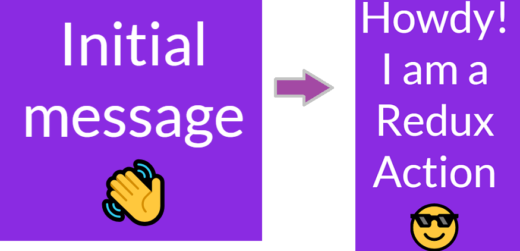

> # Redux with VanillaJs
>This is a practice application for using redux to understand the flow and how to make it with minimal files.

  _What we will build:_
    
- Redux is basically a state container for our Js applications.
- Redux is a tiny library which can be plugged into our Javascript applications ranging from VanillaJs, React.js, Vue.js, Angular.
- Redux provides an alternative to handling state i.e  data .It contains all the states in a central location.
Steps to be followed to implement redux flow in our application:
## Terminologies
Beloware the main terminologies to understand:
  - **Store**           : Contains all the states within our application
  - **Actions**         : are basically objects which dispatch/request particular action to be handled on a state
  - **Action Creators** : functions that return actions.
  - **Reducers**        : Basically pure functions that apply the requested `action`

## Principles
**Main principles behind react are**
  - There is only one way to update a state which is through `dispatching an event`.
  - Changes are made with pure functions`(reducers)`.

## Steps to follow to create a Redux Flow in our Application
Although not necessary to follow this exact pattern but it remains helpful
  - Define an `initial state`.
  - Define a `reducer` with an initial state and logic to handle action.
  - initalize store
  - Define an `action` within an `action creator`.
  - `render` value of state to DOM
  - `subscribe` to render
  - `dispatch actions` on event listener

### Store
  - Store contains state in our application,to allow access and update to our state we can use certain methods shipped with store

    - **getState()**: We can access a state using `getState()`
    - **dispatch(action)**: We can update a state using a dispatched action with `dispatch(action)`
    - **subscribe()**:used to call a function when the state has been updated through dispatched action i.e. listens to changes.

### Actions
  - Actions are dispatched in order to update a state.

     Steps to update a state via action:
     - Define an action
     - Create the action for dispatch 
     - Dispatch the action
  - The action is technically just the plain JavaScript object.Below is one such example.Actions have a t`ype property` and are `constants`
    ```
    const UPDATE_MSG = 'UPDATE_MSG'
    {
      type: UPDATE_MSG,
      message: "Howdy! I'm a Redux action to update a message :)"
      }
    ```
  - An `action creator` is a function that returns an action when called. Therefore, it “creates” an action.

    ```
    function updateMsg() {
        const UPDATE_MSG = 'UPDATE_MSG'
        
        return {
          type: UPDATE_MSG,
          message: "Howdy! I'm a Redux action."
        }
      }
    ```
    - We can dispatch an action using

    `store.dispatch(updateMsg("Howdy! I'm a Redux action."))`

### Reducers

- **All reducers are pure functions**. i.e. we take the previous state and apply the specified action to create a new state. We do not mutate the previous state

  `(previousState, action) => newState`

  ```
    function msgDisplay(state = initialState, action) {
  switch(action.type) {
    case 'UPDATE_MSG':
      const newState = Object.assign({}, state, {
        message: action.message
      })
      return newState.message
    default:
      return state.message
    }
  }
  ```
  Here we use `object.assign` to create a new object and apply our previous state to it

- We have used SetTimeout to show change in the message.

## Conclusion 
 This is a simple application that shows how Redux works with VanillaJs.
