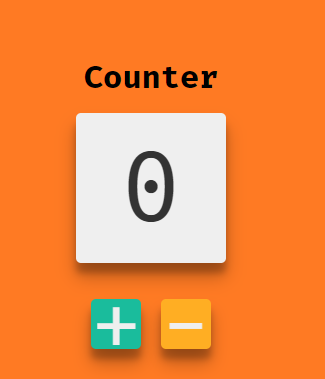

> # Redux with VanillaJs
>This is a practice application for using redux to understand the flow and how to make it with minimal files.

_What we will build:_

  

 # [Demo](https://claudz1.github.io/Redux-Vanillajs/Redux-counter/index.html)
## Adding support for Redux

- To use Redux in our files we need babel and redux we can use cdn links also
    ```
    <script src="https://unpkg.com/babel-standalone@6/babel.min.js"></script>
    <script src="https://unpkg.com/redux@latest/dist/redux.min.js"></script>
    ```